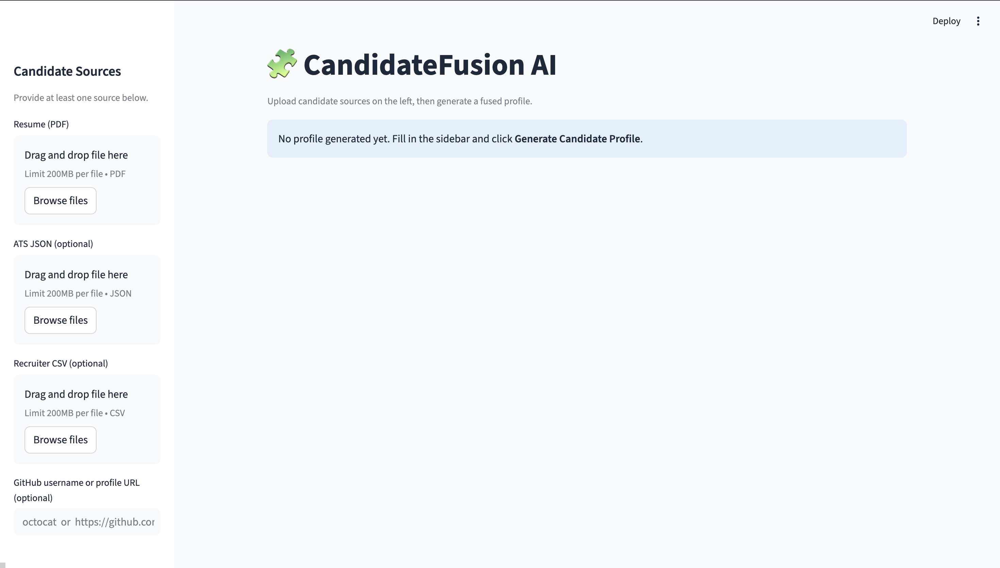
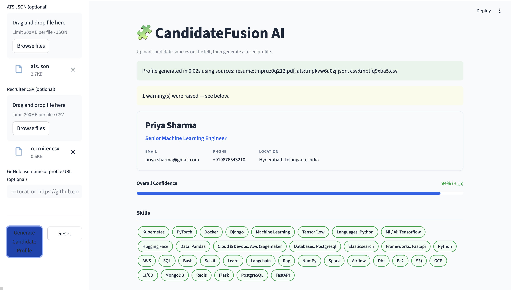
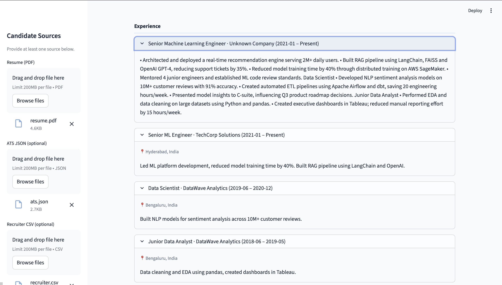
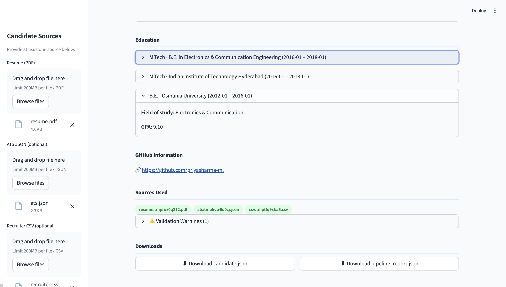

<div align="center">

# 🧩 CandidateFusion AI

### Multi-Source Candidate Data Transformation Pipeline

*Parse · Normalize · Merge · Score · Explain*

<br/>

[](https://python.org)
[](https://docs.pydantic.dev)
[](https://streamlit.io)
[](https://pymupdf.readthedocs.io)
[](https://docs.github.com/en/rest)
[](LICENSE)
[]()

<br/>

> **CandidateFusion AI** ingests candidate data from four heterogeneous sources — Resume PDF, ATS JSON, Recruiter CSV, and GitHub — and produces one trusted, explainable, validated canonical profile with per-field confidence scores and full provenance tracking. An interactive Streamlit frontend lets recruiters run the pipeline, visualize results, and download outputs without touching the command line.

<br/>

[**Live Demo**](#-running-the-frontend) · [**CLI Usage**](#-running-the-backend-cli) · [**Architecture**](#%EF%B8%8F-system-architecture) · [**Pipeline**](#-pipeline-workflow) · [**Outputs**](#-output-schema)

</div>

---

## 📋 Table of Contents

- [Overview](#-overview)
- [Problem Statement](#-problem-statement)
- [Features](#-features)
- [System Architecture](#%EF%B8%8F-system-architecture)
- [Tech Stack](#%EF%B8%8F-tech-stack)
- [Project Structure](#-project-structure)
- [Module Reference](#-module-reference)
- [Pipeline Workflow](#-pipeline-workflow)
- [Input Sources](#-supported-input-sources)
- [Output Schema](#-output-schema)
- [Conflict Resolution](#-conflict-resolution-strategy)
- [Confidence Scoring](#-confidence-scoring)
- [Provenance Tracking](#-provenance-tracking)
- [Configuration Engine](#%EF%B8%8F-configuration-engine)
- [Installation](#-installation)
- [Running the Backend CLI](#-running-the-backend-cli)
- [Running the Frontend](#-running-the-frontend)
- [Screenshots](#-screenshots)
- [Testing](#-testing)
- [Roadmap](#-roadmap)
- [Author](#-author)

---

## 🌍 Overview

Modern recruitment pipelines collect candidate data from many independent systems: ATS exports, recruiter spreadsheets, uploaded resumes, and public developer profiles. These records are rarely clean. The same candidate may appear under slightly different names, with different phone formats, contradictory experience dates, inconsistent skill spellings, and missing contact information.

**CandidateFusion AI** solves this problem with a deterministic, explainable data fusion engine. It:

1. Parses each source independently through a dedicated parser
2. Normalizes all values to canonical forms (E.164 phones, YYYY-MM dates, canonical skill names)
3. Merges records using a priority-ordered conflict resolution strategy
4. Computes a confidence score for every field and an overall profile confidence
5. Records full provenance — source, method, raw value, confidence — for every selected value
6. Validates the merged profile with Pydantic v2 (invalid values become `null`; the pipeline never crashes)
7. Projects the output through a runtime-configurable schema so field names, visibility, and structure can be changed without touching code

The result is a single `candidate.json` and a `pipeline_report.json` that a downstream ATS, analytics platform, or recruiter can trust completely.

An interactive **Streamlit frontend** wraps the entire pipeline, making it accessible to non-technical recruiters.

---

## 🎯 Problem Statement

| Pain Point | Impact |
|---|---|
| Duplicate candidate records across systems | Recruiters contact the same person multiple times |
| Conflicting field values (different names, emails) | No single source of truth |
| Multiple date formats (`Jan 2022`, `01/2022`, `2022-01`) | Downstream queries break |
| Inconsistent skill names (`ML`, `Machine Learning`, `machine-learning`) | Skill matching fails |
| Invalid phone numbers and emails | Outreach fails silently |
| No traceability for field values | Impossible to audit or explain decisions |
| Hard-coded output schemas | Schema changes require code changes |

CandidateFusion AI addresses every one of these systematically.

---

## ✨ Features

| # | Feature | Description |
|---|---|---|
| 1 | **Resume PDF Parsing** | Extracts name, email, phone, skills, experience, education, and location using PyMuPDF — no OCR dependency |
| 2 | **ATS JSON Parsing** | Handles nested, variably-keyed ATS exports; maps fields to the canonical schema |
| 3 | **Recruiter CSV Parsing** | Tolerates missing columns, malformed rows, and varying column names |
| 4 | **GitHub Integration** | Fetches name, bio, languages, repositories, and profile URL via the GitHub REST API; gracefully handles API failures |
| 5 | **Intelligent Conflict Resolution** | Priority-ordered merge (Resume > ATS > GitHub > CSV) with full audit trail |
| 6 | **Data Normalization** | E.164 phones · YYYY-MM dates · canonical skill names · validated emails · standardized locations |
| 7 | **Confidence Scoring** | Per-field and overall confidence based on source reliability, field quality, and cross-source agreement |
| 8 | **Provenance Tracking** | Every output field records source, extraction method, raw value, and confidence |
| 9 | **Pydantic v2 Validation** | Invalid values become `null`; the pipeline never crashes on bad data |
| 10 | **Runtime Configuration** | JSON config file controls field aliases, exclusions, provenance visibility, and confidence display — no code changes needed |
| 11 | **Streamlit Interactive UI** | Upload sources, generate profiles, visualize results, and download outputs in a browser |
| 12 | **Downloadable Outputs** | `candidate.json` and `pipeline_report.json` available for direct download from the UI |
| 13 | **Structured Logging** | Every pipeline stage logs decisions, warnings, and errors with timestamps |
| 14 | **Extensible Parser Framework** | Adding a new source requires only a new parser module — merge, confidence, and provenance engines require no changes |

---

## 🏗️ System Architecture

```
┌─────────────────────────────────────────────────────────────────────────┐
│                         CandidateFusion AI                              │
│                                                                         │
│   ┌──────────────────────────────────────────────────────────────────┐  │
│   │                    Streamlit Frontend                            │  │
│   │   streamlit_app.py · frontend/ui_components.py                  │  │
│   │   frontend/pipeline_client.py · frontend/styles.py              │  │
│   └──────────────────────┬───────────────────────────────────────────┘  │
│                          │  calls                                        │
│                          ▼                                               │
│   ┌──────────────────────────────────────────────────────────────────┐  │
│   │                  engine/projector.py                             │  │
│   │           Applies runtime config · shapes final output           │  │
│   └──────────────────────┬───────────────────────────────────────────┘  │
│                          │                                               │
│        ┌─────────────────┼─────────────────┐                            │
│        ▼                 ▼                 ▼                  ▼          │
│  ┌──────────┐     ┌──────────┐     ┌──────────┐     ┌──────────────┐   │
│  │  parsers/│     │  parsers/│     │  parsers/│     │   parsers/   │   │
│  │csv_parser│     │ats_parser│     │  resume  │     │github_parser │   │
│  │   .py    │     │   .py    │     │_parser.py│     │    .py       │   │
│  └────┬─────┘     └────┬─────┘     └────┬─────┘     └──────┬───────┘   │
│       └────────────────┴────────────────┴──────────────────┘            │
│                                    │                                     │
│                                    ▼                                     │
│   ┌──────────────────────────────────────────────────────────────────┐  │
│   │                    engine/merge.py                               │  │
│   │        Priority-ordered conflict resolution · field union        │  │
│   └──────────────────────┬───────────────────────────────────────────┘  │
│                          │                                               │
│            ┌─────────────┴──────────────┐                               │
│            ▼                            ▼                                │
│   ┌─────────────────┐        ┌──────────────────────┐                   │
│   │engine/normalize │        │  engine/confidence.py│                   │
│   │      .py        │        │  Per-field + overall  │                   │
│   └─────────────────┘        └──────────────────────┘                   │
│            │                            │                                │
│            └─────────────┬─────────────┘                                │
│                          ▼                                               │
│   ┌──────────────────────────────────────────────────────────────────┐  │
│   │                 engine/provenance.py                             │  │
│   │          Records source · method · raw value · confidence        │  │
│   └──────────────────────┬───────────────────────────────────────────┘  │
│                          │                                               │
│                          ▼                                               │
│   ┌──────────────────────────────────────────────────────────────────┐  │
│   │                  engine/validator.py                             │  │
│   │         Pydantic v2 validation · null-safe · never crashes       │  │
│   └──────────────────────┬───────────────────────────────────────────┘  │
│                          │                                               │
│            ┌─────────────┴──────────────┐                               │
│            ▼                            ▼                                │
│   ┌─────────────────┐        ┌──────────────────────┐                   │
│   │  candidate.json │        │ pipeline_report.json  │                   │
│   └─────────────────┘        └──────────────────────┘                   │
└─────────────────────────────────────────────────────────────────────────┘
```

---

## 🛠️ Tech Stack

### Backend

| Technology | Version | Purpose |
|---|---|---|
| Python | 3.11+ | Core language |
| Pydantic | v2 | Schema definition and runtime validation |
| PyMuPDF (`fitz`) | Latest | PDF text extraction without OCR |
| pdfplumber | Latest | Supplementary PDF table extraction |
| Requests | Latest | GitHub REST API HTTP client |
| python-phonenumbers | Latest | Phone parsing and E.164 normalization |
| python-dateutil | Latest | Flexible date string parsing |
| Pandas | Latest | CSV ingestion and transformation |
| RapidFuzz | Latest | Fuzzy skill name matching |
| pytest | Latest | Unit and integration testing |

### Frontend

| Technology | Purpose |
|---|---|
| Streamlit | Interactive web UI framework |
| HTML + inline CSS | Custom component rendering |
| Streamlit `st.markdown(unsafe_allow_html=True)` | Styled card and pill components |

### External APIs

| API | Usage |
|---|---|
| GitHub REST API v3 | Public profile, repositories, and language data |

---

## 📂 Project Structure

```
candidate-fusion-ai/
│
├── 📄 streamlit_app.py          # Streamlit entry point — page config, sidebar, run loop
│
├── 📄 main.py                   # CLI entry point — argparse, pipeline orchestration
│
├── 📄 requirements.txt
├── 📄 README.md
├── 📄 .gitignore
│
├── 🗂️ .streamlit/
│   └── config.toml              # Streamlit theme (primary color, font, layout)
│
├── 🗂️ frontend/
│   ├── __init__.py
│   ├── pipeline_client.py       # Bridges the Streamlit UI to the backend pipeline
│   ├── styles.py                # Injects global CSS into the Streamlit page
│   └── ui_components.py        # All render_*() display functions (no business logic)
│
├── 🗂️ parsers/
│   ├── __init__.py
│   ├── csv_parser.py            # Recruiter CSV → canonical dict
│   ├── ats_parser.py            # ATS JSON → canonical dict
│   ├── resume_parser.py         # Resume PDF → canonical dict (PyMuPDF)
│   └── github_parser.py         # GitHub REST API → canonical dict
│
├── 🗂️ engine/
│   ├── __init__.py
│   ├── schema.py                # Pydantic v2 canonical CandidateProfile model
│   ├── normalize.py             # Phone · date · email · skill · location normalization
│   ├── merge.py                 # Priority-ordered conflict resolution engine
│   ├── confidence.py            # Per-field and overall confidence scoring
│   ├── provenance.py            # ProvenanceTracker — records every field decision
│   ├── validator.py             # Post-merge validation; invalid values → null
│   └── projector.py             # Applies runtime config to shape the final output
│
├── 🗂️ config/
│   ├── default.json             # Default output projection config
│   └── minimal.json             # Minimal output (no provenance, no per-field confidence)
│
├── 🗂️ input/                    # Sample input files
│   ├── recruiter.csv
│   ├── ats.json
│   ├── resume_alice.pdf
│   └── resume_bob.pdf
│
├── 🗂️ output/                   # Pipeline output files (git-ignored)
│   ├── candidate.json
│   └── pipeline_report.json
│
├── 🗂️ tests/
│   ├── test_normalize.py
│   ├── test_merge.py
│   ├── test_parsers.py
│   ├── test_confidence.py
│   └── test_validator.py
│
├── 🗂️ docs/
│   └── images/
│       ├── home.png
│       ├── profile.png
│       └── downloads.png
│
└── 🗂️ logs/
    └── pipeline.log             # Structured pipeline execution log
```

---

## 📦 Module Reference

Every module has a single, stated responsibility. No module reaches into another module's domain.

---

### `parsers/csv_parser.py`

**Responsibility:** Read a recruiter-exported CSV file and return a canonical dictionary.

**Design decisions:**
- Uses `pandas` for robust CSV parsing with encoding fallback (`utf-8` → `latin-1`)
- Accepts flexible column naming: `full_name`, `name`, `candidate_name` are all mapped to `full_name`
- Malformed rows (wrong column count, unparseable data) are skipped with a logged warning; the parser never raises
- Missing optional columns silently return `None` for that field
- Returns `None` if the file cannot be read, so the merge engine simply receives no CSV record

---

### `parsers/ats_parser.py`

**Responsibility:** Parse an ATS (Applicant Tracking System) JSON export and return a canonical dictionary.

**Design decisions:**
- Handles both flat and nested ATS schemas via a configurable field-path map
- Unknown top-level keys are recorded in a `_unknown_fields` entry for debugging but do not cause failures
- Array fields (`skills`, `experience`, `education`) are normalized to lists even when the ATS provides a single-element dict
- Dates in ATS records often vary by vendor; all dates are passed through `normalize_date()` immediately on extraction

---

### `parsers/resume_parser.py`

**Responsibility:** Extract structured candidate data from a Resume PDF using text extraction (not OCR).

**Extracted fields:**
- Full name (first large-font text block or first line heuristic)
- Email addresses (regex)
- Phone numbers (regex + phonenumbers library validation)
- Skills (section header detection + keyword matching against canonical skill list)
- Work experience (section header detection → company/title/date range extraction)
- Education (section header detection → institution/degree/date extraction)
- Location (city/country pattern after contact block)

**Design decisions:**
- Uses `PyMuPDF` (`fitz`) for primary text extraction; falls back to `pdfplumber` for complex layouts
- No OCR — scanned PDFs without an embedded text layer will return partial results, logged as a warning
- Section detection uses a ranked list of header keywords (`EXPERIENCE`, `WORK HISTORY`, `EMPLOYMENT`, etc.)
- Returns a partial result rather than raising on extraction failures; the merge engine handles missing fields gracefully

---

### `parsers/github_parser.py`

**Responsibility:** Fetch public candidate data from the GitHub REST API.

**Collected data:**
- Display name
- Bio / headline
- Public repositories (name, language, description, star count)
- Top programming languages (aggregated across repos)
- Profile URL

**Design decisions:**
- Accepts either a username string or a full `https://github.com/<username>` URL
- All API calls are wrapped in try/except; rate-limit errors and 404s return `None` with a logged warning
- Unauthenticated requests are supported; a `GITHUB_TOKEN` environment variable is used when present to raise the rate limit
- Languages are deduplicated and ranked by repository count before being passed to the skill merge

---

### `engine/schema.py`

**Responsibility:** Define the canonical `CandidateProfile` Pydantic v2 model and all supporting sub-models.

**Key models:**
- `CandidateProfile` — top-level output schema
- `ExperienceEntry` — one position held
- `EducationEntry` — one degree or certification
- `SkillEntry` — one skill with canonical name, sources, and confidence
- `LinkEntry` — one URL with optional label
- `FieldProvenance` — per-field provenance record
- `ProvenanceEntry` — one source's contribution to a field

The schema is the single source of truth. All parsers output dicts that map to this schema; the validator enforces it; the projector reads it.

---

### `engine/normalize.py`

**Responsibility:** Convert raw string values into their canonical normalized forms.

| Function | Input | Output |
|---|---|---|
| `normalize_phone(raw)` | `"(555) 867-5309"` | `"+15558675309"` (E.164) |
| `normalize_email(raw)` | `"Alice@Example.COM "` | `"alice@example.com"` |
| `normalize_date(raw)` | `"Jan 2022"`, `"01/2022"`, `"2022"` | `"2022-01"` |
| `normalize_name(raw)` | `"ALICE SMITH  "` | `"Alice Smith"` |
| `normalize_skill(raw)` | `"ML"`, `"machine learning"` | `"Machine Learning"` |
| `normalize_location(raw)` | `"blr"`, `"bangalore"` | `"Bengaluru, India"` |
| `normalize_url(raw)` | `"github.com/alice"` | `"https://github.com/alice"` |
| `normalize_years_experience(raw)` | `"5+ years"`, `"3-5"` | `5.0`, `4.0` |

The skill alias map contains 80+ entries covering common abbreviations, alternate spellings, and regional variants. It lives in `normalize.py` and is designed to be extended without touching any other module.

---

### `engine/merge.py`

**Responsibility:** Merge canonical dictionaries from all parsers into one `CandidateProfile`.

**Priority order (highest → lowest):**

```
Resume  (0.95)  >  ATS  (0.90)  >  GitHub  (0.88)  >  CSV  (0.82)
```

**Scalar field strategy:** Pick the value from the highest-priority source that provides a non-null value.

**List field strategy:** Union all values from all sources, deduplicate after normalization, then sort by confidence.

**Deduplication keys:**
- `emails` — normalized lowercase email string
- `phones` — E.164 string
- `skills` — canonical skill name (lowercased)
- `experience` — `(company.lower(), title.lower())`
- `education` — `(institution.lower(), degree.lower())`

Every merge decision is recorded in the `ProvenanceTracker` before the function returns.

---

### `engine/confidence.py`

**Responsibility:** Compute per-field and overall confidence scores.

**Algorithm:**

```
field_confidence = source_baseline
                 + field_quality_delta
                 + cross_source_agreement_bonus

overall_confidence = weighted_average(key_field_confidences)
                   + multi_source_bonus
                   - missing_critical_field_penalty
```

**Source baselines:**

| Source | Baseline |
|---|---|
| Resume | 0.95 |
| ATS | 0.90 |
| GitHub | 0.88 |
| CSV | 0.82 |

**Quality rules (examples):**
- `full_name` with first and last name: `+0.05`
- `full_name` longer than 30 characters: `-0.05` (likely noise)
- `years_experience` outside `[0, 60]`: `-0.10`
- Each additional source agreeing on a value: `+0.02`

---

### `engine/provenance.py`

**Responsibility:** Track every field value seen during the pipeline and record which source was selected.

**`ProvenanceTracker` API:**

```python
tracker.record(field_name, source, method, raw_value, confidence)
tracker.select(field_name, winning_source, final_confidence)
provenance_dict = tracker.finalize()
```

After `finalize()`, every field in the output contains a `FieldProvenance` object with:
- `selected_source` — the source whose value was used
- `entries` — all candidate values seen (including losers)
- `confidence` — the final confidence for the selected value

This makes every conflict resolution decision fully auditable.

---

### `engine/validator.py`

**Responsibility:** Post-merge validation. Sanitize the merged `CandidateProfile` without raising.

**Rules enforced:**
- `full_name` must be ≥ 2 characters
- All emails must match the RFC-compliant regex
- All phones must start with `+` (E.164 confirmed)
- `years_experience` must be in `[0, 60]`
- `SkillEntry` must have a non-empty `canonical_name`
- `ExperienceEntry` must have at least one of `company` or `title`
- `EducationEntry` must have `institution`
- `overall_confidence` is clamped to `[0.0, 1.0]`

Invalid values are set to `null` and the violation is logged as a warning. The validator never raises.

---

### `engine/projector.py`

**Responsibility:** Apply runtime configuration to shape the final output dictionary.

**Supported config keys:**

| Key | Type | Effect |
|---|---|---|
| `hide_provenance` | bool | Removes the `provenance` block from output |
| `hide_confidence` | bool | Removes `overall_confidence` and per-skill confidence |
| `field_aliases` | dict | Renames output fields (`{"full_name": "name"}`) |
| `exclude_fields` | list | Removes named fields from output |

This means the same pipeline can produce a rich internal record (with full provenance) and a clean external profile (without it) simply by pointing to different config files.

---

### `frontend/pipeline_client.py`

**Responsibility:** Bridge the Streamlit UI to the backend pipeline.

Accepts file uploads and a GitHub username from the UI layer, writes them to temporary paths, invokes the pipeline, reads back the output files, and returns the `CandidateProfile` object and report dict to the UI. Isolates all I/O from both the UI layer and the pipeline.

---

### `frontend/styles.py`

**Responsibility:** Inject the global CSS stylesheet into the Streamlit page.

Defines the `cf-card`, `cf-skill-tag`, `cf-pill-success`, `cf-pill-warning`, `cf-muted`, and `cf-section-title` CSS classes used throughout `ui_components.py`.

---

### `frontend/ui_components.py`

**Responsibility:** All display functions. No business logic. No pipeline calls.

Each `render_*()` function accepts a `CandidateProfile` (or pieces of one) and calls `st.markdown()` with `unsafe_allow_html=True`. HTML strings are written as plain f-strings — never wrapped in `textwrap.dedent()` — to prevent CommonMark from misinterpreting indented inner lines as code blocks.

---

## 🔄 Pipeline Workflow

```
┌─────────────────────────────────────────────────────┐
│                   INPUT SOURCES                     │
│  Resume PDF  │  ATS JSON  │  Recruiter CSV  │  GitHub│
└──────┬────────────┬─────────────┬──────────────┬────┘
       │            │             │              │
       ▼            ▼             ▼              ▼
┌────────────────────────────────────────────────────┐
│                    PARSERS                         │
│  resume_parser  ats_parser  csv_parser  github_    │
│                                         parser     │
└──────────────────────────┬─────────────────────────┘
                           │ canonical dicts
                           ▼
┌────────────────────────────────────────────────────┐
│              NORMALIZATION ENGINE                  │
│   Phones→E.164  Dates→YYYY-MM  Skills→Canonical   │
│   Emails validated  Names title-cased  URLs fixed  │
└──────────────────────────┬─────────────────────────┘
                           │
                           ▼
┌────────────────────────────────────────────────────┐
│                  MERGE ENGINE                      │
│   Scalar fields: highest-priority source wins      │
│   List fields: union + deduplicate                 │
│   Conflict log written to ProvenanceTracker        │
└──────────────────────────┬─────────────────────────┘
                           │
              ┌────────────┴────────────┐
              ▼                         ▼
┌─────────────────────┐    ┌────────────────────────┐
│  CONFIDENCE ENGINE  │    │   PROVENANCE TRACKER   │
│  Per-field scores   │    │   source · method ·    │
│  Overall score      │    │   raw_value · conf     │
└──────────┬──────────┘    └────────────┬───────────┘
           └────────────┬───────────────┘
                        ▼
┌────────────────────────────────────────────────────┐
│               VALIDATION ENGINE                    │
│   Pydantic v2 · invalid values → null              │
│   Warnings logged · never raises                   │
└──────────────────────────┬─────────────────────────┘
                           │
                           ▼
┌────────────────────────────────────────────────────┐
│              CONFIG PROJECTION LAYER               │
│   Field aliases · exclusions · hide provenance     │
└──────────────────────────┬─────────────────────────┘
                           │
              ┌────────────┴────────────┐
              ▼                         ▼
     candidate.json           pipeline_report.json
```

---

## 📥 Supported Input Sources

### 📊 Structured Sources

**Recruiter CSV** — Standard recruiter spreadsheet export. Common columns:

```
name, email, phone, location, current_title, company, years_experience, skills
```

**ATS JSON** — Applicant Tracking System export. Supports nested schemas from common ATS platforms. Example structure:

```json
{
  "candidate": {
    "personal": { "full_name": "Alice Smith", "email": "alice@example.com" },
    "professional": { "current_title": "ML Engineer", "skills": ["Python", "TensorFlow"] },
    "experience": [ { "title": "...", "company": "...", "start": "2021-03" } ]
  }
}
```

### 📄 Unstructured Sources

**Resume PDF** — Any text-layer PDF resume. The parser handles multi-column layouts, varied section headings, and mixed date formats.

**GitHub Profile** — Public GitHub username or profile URL. Fetches via the unauthenticated REST API; set `GITHUB_TOKEN` in your environment for higher rate limits.

---

## 📤 Output Schema

### `candidate.json`

```json
{
  "candidate_id": "3f7a2d1c-8b4e-4f90-a123-000000000001",
  "full_name": "Alice Smith",
  "emails": ["alice.smith@example.com"],
  "phones": ["+15558675309"],
  "location": "San Francisco, CA",
  "links": [
    { "url": "https://github.com/alicesmith", "label": "GitHub" }
  ],
  "headline": "Senior Machine Learning Engineer",
  "years_experience": 6.0,
  "skills": [
    {
      "name": "Python",
      "canonical_name": "Python",
      "sources": ["resume", "github", "csv"],
      "confidence": 0.99
    },
    {
      "name": "TensorFlow",
      "canonical_name": "TensorFlow",
      "sources": ["resume", "ats"],
      "confidence": 0.97
    }
  ],
  "experience": [
    {
      "title": "Senior ML Engineer",
      "company": "TechCorp Inc.",
      "start_date": "2021-03",
      "end_date": "Present",
      "description": "Led development of real-time recommendation engine...",
      "location": "San Francisco, CA"
    }
  ],
  "education": [
    {
      "institution": "Stanford University",
      "degree": "M.S.",
      "field_of_study": "Computer Science",
      "start_date": "2017-09",
      "end_date": "2019-06",
      "gpa": 3.9
    }
  ],
  "provenance": {
    "full_name": {
      "selected_source": "resume",
      "entries": [
        { "source": "resume", "method": "regex", "raw_value": "Alice Smith", "confidence": 0.95 },
        { "source": "csv", "method": "direct_field", "raw_value": "ALICE SMITH", "confidence": 0.82 }
      ],
      "confidence": 0.95
    }
  },
  "overall_confidence": 0.91
}
```

### `pipeline_report.json`

```json
{
  "run_id": "3f7a2d1c-8b4e-4f90-a123-000000000001",
  "timestamp": "2025-07-01T10:30:00Z",
  "sources_attempted": ["csv", "ats", "resume", "github"],
  "sources_succeeded": ["resume", "github"],
  "sources_failed": ["csv", "ats"],
  "failure_reasons": {
    "csv": "File not provided",
    "ats": "File not provided"
  },
  "field_coverage": {
    "full_name": true,
    "emails": true,
    "phones": true,
    "location": false,
    "skills": true,
    "experience": true,
    "education": true
  },
  "validation_warnings": [
    "Dropping invalid email: 'not-an-email'"
  ],
  "overall_confidence": 0.91,
  "processing_time_seconds": 1.35
}
```

---

## ⚖️ Conflict Resolution Strategy

When two or more sources provide different values for the same field, the merge engine applies these rules in order:

**1. Priority ordering (scalar fields)**

```
Resume  >  ATS  >  GitHub  >  CSV
```

The value from the highest-priority source that supplies a non-null, normalized, valid value wins.

**2. Union with deduplication (list fields)**

For `emails`, `phones`, `skills`, `experience`, and `education`, all valid values from all sources are collected. After normalization and deduplication, the result is the union — no valid value from any source is discarded.

**3. Full audit trail**

Every losing value is still recorded in `provenance[field].entries` with its source, raw value, and confidence. Reviewers can see exactly what was discarded and why.

**Example conflict scenario:**

| Source | `full_name` value | Selected? |
|---|---|---|
| Resume | `"Alice Smith"` | ✅ Yes (highest priority, valid) |
| CSV | `"ALICE SMITH"` | ❌ No (lower priority; recorded in provenance) |
| GitHub | `"alicesmith"` | ❌ No (no space; lower priority) |

---

## 📊 Confidence Scoring

### Per-field confidence

```
confidence = source_baseline + quality_delta + agreement_bonus
```

**Source baselines:**

| Source | Baseline Score |
|---|---|
| Resume | 0.95 |
| ATS | 0.90 |
| GitHub | 0.88 |
| CSV | 0.82 |

**Quality adjustments (selected examples):**

| Condition | Adjustment |
|---|---|
| `full_name` has first and last name | +0.05 |
| `full_name` > 30 characters | −0.05 |
| `years_experience` outside `[0, 60]` | −0.10 |
| `location` contains a comma | +0.03 |
| Each additional source agreeing | +0.02 per source |

### Overall confidence

```
overall = weighted_average(key_field_confidences)
        + min(len(sources_present) × 0.02, 0.08)
        − (0.10 if full_name missing)
        − (0.08 if email missing)
```

**Key field weights:**

| Field | Weight |
|---|---|
| full_name | 20% |
| emails | 20% |
| skills | 15% |
| experience | 15% |
| education | 10% |
| phones | 10% |
| education | 10% |
| years_experience | 5% |
| location | 5% |

---

## 📍 Provenance Tracking

Every field in the output knows exactly where its value came from.

```
provenance
  └── full_name
        ├── selected_source: "resume"
        ├── confidence: 0.95
        └── entries
              ├── { source: "resume",  method: "regex",        raw: "Alice Smith",  conf: 0.95 }
              ├── { source: "csv",     method: "direct_field", raw: "ALICE SMITH",  conf: 0.82 }
              └── { source: "github",  method: "api",          raw: "alicesmith",   conf: 0.88 }
```

This enables:
- Full audit trails for compliance
- Debugging of unexpected merge decisions
- Source-level data quality analysis over time

---

## ⚙️ Configuration Engine

Point to a different config file to change the output without touching code.

**`config/default.json`** — Full output with provenance

```json
{
  "hide_provenance": false,
  "hide_confidence": false,
  "field_aliases": {},
  "exclude_fields": []
}
```

**`config/minimal.json`** — Clean output for external systems

```json
{
  "hide_provenance": true,
  "hide_confidence": true,
  "field_aliases": {
    "full_name": "name",
    "years_experience": "total_experience_years"
  },
  "exclude_fields": ["links"]
}
```

---

## 🚀 Installation

**Prerequisites:** Python 3.11+

```bash
# 1. Clone the repository
git clone https://github.com/pranathiyadav/candidate-fusion-ai.git
cd candidate-fusion-ai

# 2. (Recommended) Create a virtual environment
python -m venv venv
source venv/bin/activate          # macOS / Linux
venv\Scripts\activate             # Windows

# 3. Install dependencies
pip install -r requirements.txt

# 4. (Optional) Set GitHub token for higher API rate limits
export GITHUB_TOKEN=ghp_your_token_here
```

---

## 💻 Running the Backend CLI

```bash
python main.py \
  --resume  input/resume_alice.pdf \
  --ats     input/ats.json \
  --csv     input/recruiter.csv \
  --github  alicesmith \
  --config  config/default.json \
  --output  output
```

**CLI arguments:**

| Argument | Required | Description |
|---|---|---|
| `--resume` | No | Path to candidate resume PDF |
| `--ats` | No | Path to ATS JSON export |
| `--csv` | No | Path to recruiter CSV file |
| `--github` | No | GitHub username or profile URL |
| `--config` | No | Path to projection config JSON (default: `config/default.json`) |
| `--output` | No | Output directory (default: `output/`) |

At least one source must be provided. All other sources are optional; the pipeline gracefully handles any combination.

**Output files written to `--output`:**

```
output/
├── candidate.json          # Canonical candidate profile
└── pipeline_report.json    # Pipeline execution report
```

---

## 🖥️ Running the Frontend

```bash
streamlit run streamlit_app.py
```

The app opens at `http://localhost:8501`.

**What the frontend does:**

The sidebar provides file uploaders for Resume PDF, ATS JSON, and Recruiter CSV, plus a text input for a GitHub username. Clicking **Generate Candidate Profile** invokes the full backend pipeline and renders the result in the main panel:

| Section | Content |
|---|---|
| **Identity Header** | Name, headline, email, phone, location, overall confidence bar |
| **Skills** | Colour-coded pill tags sorted by confidence (green = high, blue = medium, grey = low) |
| **Experience** | Collapsible expanders, one per position, showing title · company · date range · description |
| **Education** | Collapsible expanders, one per degree, showing institution · field of study · GPA |
| **GitHub Information** | Username and profile link if a GitHub source was used |
| **Sources Used** | Green pill badges for each source that contributed to the profile |
| **Validation Warnings** | Collapsible list of any values that were dropped or corrected |
| **Downloads** | One-click download for `candidate.json` and `pipeline_report.json` |
| **Reset** | Clears all inputs and results |

---

## 📸 Screenshots

<table>
  <tr>
    <td align="center"><strong>Home — Upload Sources</strong></td>
    <td align="center"><strong>Generated Profile</strong></td>
  </tr>

  <tr>
    <td>
      
    </td>
    <td>
      
    </td>
  </tr>

  <tr>
    <td align="center"><strong>Downloads Panel</strong></td>
    <td align="center"><strong>Validation & Downloads</strong></td>
  </tr>

  <tr>
    <td>
      
    </td>
    <td>
      
    </td>
  </tr>
</table>

---

## 🧪 Testing

```bash
# Run all tests
pytest

# Run with verbose output
pytest -v

# Run a specific test module
pytest tests/test_normalize.py -v

# Run with coverage report
pytest --cov=engine --cov=parsers --cov-report=term-missing
```

**Test coverage:**

| Module | Tests |
|---|---|
| `test_normalize.py` | Phone E.164 conversion · date parsing · email validation · skill canonicalization · location expansion |
| `test_merge.py` | Priority ordering · list union · deduplication · experience conflict · education conflict |
| `test_parsers.py` | Malformed CSV · broken JSON · missing resume · partial GitHub data |
| `test_confidence.py` | Source baselines · quality deltas · agreement bonus · overall score computation |
| `test_validator.py` | Invalid email dropped · non-E164 phone dropped · unrealistic experience rejected · missing institution dropped |

---

## 🗺️ Roadmap

- [x] Resume PDF parsing
- [x] ATS JSON parsing
- [x] Recruiter CSV parsing
- [x] GitHub REST API integration
- [x] Normalization engine
- [x] Priority-ordered merge engine
- [x] Per-field and overall confidence scoring
- [x] Full provenance tracking
- [x] Pydantic v2 validation
- [x] Runtime configuration projection
- [x] CLI interface
- [x] Streamlit interactive frontend
- [ ] **FastAPI REST API** — wrap the pipeline as a service endpoint
- [ ] **LinkedIn Integration** — parse public LinkedIn profiles
- [ ] **HackerRank / LeetCode Integration** — fetch coding contest scores
- [ ] **Batch Candidate Processing** — accept a directory of resumes
- [ ] **PostgreSQL Support** — persist profiles to a relational database
- [ ] **Docker** — containerized deployment with `docker-compose`
- [ ] **LLM Candidate Summary** — generate a natural-language summary using Claude / GPT
- [ ] **Resume Ranking** — rank candidates against a job description
- [ ] **Candidate Recommendation Engine** — similarity search across the profile store
- [ ] **OCR Support** — handle scanned PDFs via Tesseract fallback

---

## 👩‍💻 Author

**Pranathi Yadav**
B.E. Computer Science Engineering (AI & ML)
Chaitanya Bharathi Institute of Technology, Hyderabad

[](https://github.com/pranathiyadav)

---


## 📄 License

This project is licensed under the [MIT License](LICENSE).

---

<div align="center">

If you found this project useful, please consider giving it a ⭐

*Built as part of the Eightfold AI Engineering Internship application (Jul–Dec 2026)*


</div>
=======
</div>

